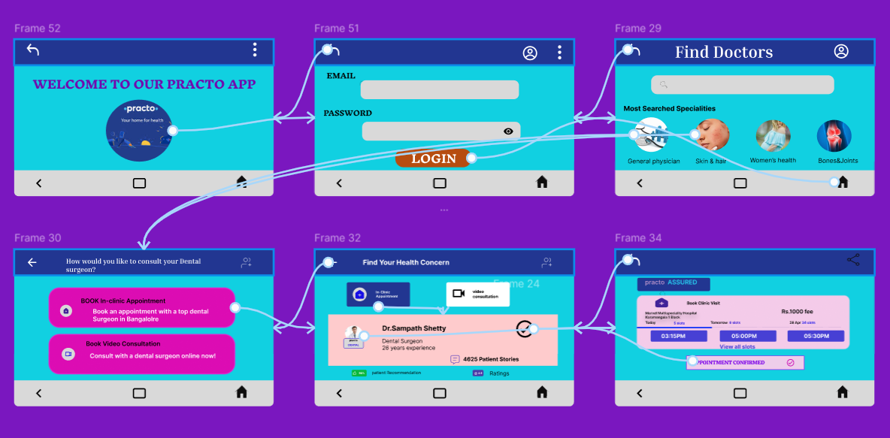
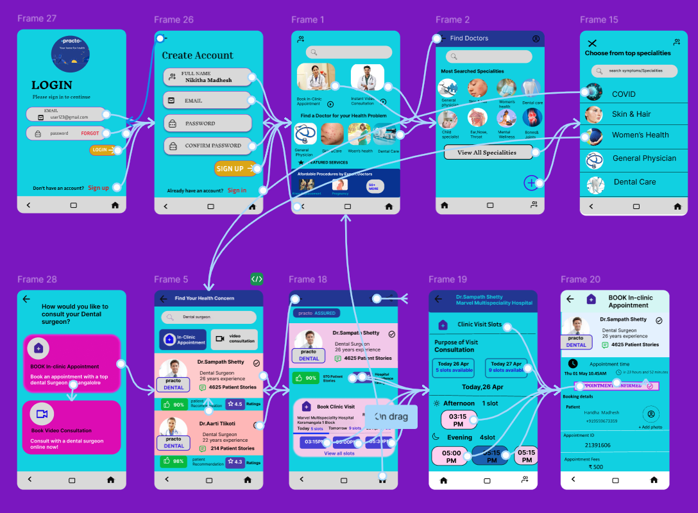

# Practo App

A modern healthcare application that provides a seamless experience for both web and mobile users.

## Overview

This repository contains the Practo application, a healthcare platform that connects patients with healthcare providers. The application is designed to work across both web and mobile platforms, providing a consistent and user-friendly experience.

## Features

- **Cross-Platform Compatibility**: Available on both web and mobile platforms
- **Modern UI/UX**: Clean and intuitive interface for easy navigation
- **Responsive Design**: Adapts to different screen sizes and devices
- **Healthcare Services**: Comprehensive healthcare management system

## Screenshots

### Web Version

### Mobile Version

## Getting Started

To get started with the project, follow these steps:

1. Clone the repository
2. Install dependencies
3. Run the development server

## Technologies Used

- Frontend Framework
- Responsive Design
- Mobile-First Approach
- Modern UI Components

## Contributing

Contributions are welcome! Please feel free to submit a Pull Request.

## License

This project is licensed under the MIT License - see the LICENSE file for details.

## Contact

For any queries or support, please reach out to the repository owner. 